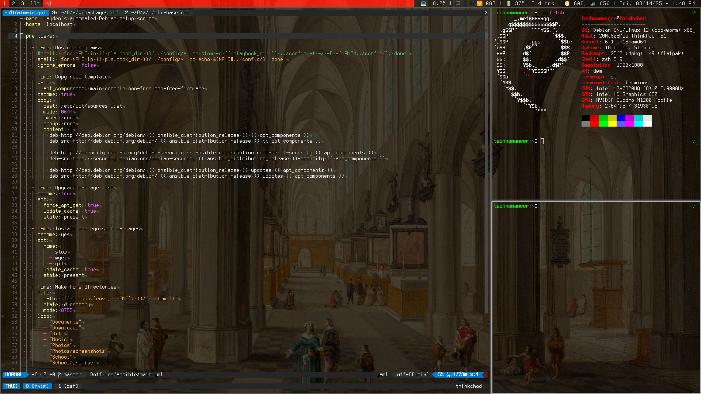

Beautifully Breathtaking, Glorious Debian Dotfiles
===

Overview
---
This is my set of personal Debian dotfiles, having been used in some form since 2023. Because they're tailored to my preferences, they're probably not a great fit for most out-of-the-box. However, they can serve as a good framework for others in making their own configurations. Some of the stand-out features are enumerated below:  
- **Distro:** Debian  
- **Shell:** zsh  
- **Editor:** nvim  
- **Window Manager:** [dwm](https://github.com/techno-sorcery/dwm)  
- **Status bar:** dwmblocks  
- **Launcher:** rofi  
- **Terminal Emulator:** [st](https://github.com/techno-sorcery/st)  
- **Font:** Terminus  

Installation
---
### Preparation
These dotfiles are meant to be deployed on a base debian installation. As such, after connecting to the internet, you should run the following command as root to install its dependencies:  

    apt install sudo ansible git

Add yourself to the sudoers group if you haven't already (might be something different like "wheel" or "whirly-dirly thing" on other distros):  

    usermod -aG sudo [your username]

### Tags
The Ansible playbook includes the following tags, which can easily be excluded if you don't want a particular feature set:  
- **base:** A base, command-line only installation  
- **extras:** Extra CLI components, per my preference
- **gui:** Additional components supporting a GUI  
- **gui-extras:** Extra GUI components, per my preference
- **flatpak:** All tasks pertaining to flatpak  
- **flatpak-base:** A base flatpak installation  
- **flatpak-extras:** Extra programs installed through flatpak  
- **bluetooth:** All tasks pertaining to bluetooth  
- **kjv:** CLI Bible viewer  

### Installation
Log into your user account, and clone the repo into your home directory:  

    git clone https://github.com/techno-sorcery/Dotfiles-V2

If you'd like to modify the configuration to suit your own preferences, it's recommended that you create a fork and clone that instead.  

Go to the ansible folder within your new dotfiles folder, and run the following to start system configuration:  

    ansible-playbook setup.yml --ask-become-pass

Let ansible do its thing, and you're done. Feel free to exclude any of the aforementioned tags to ccustomize your installation.
